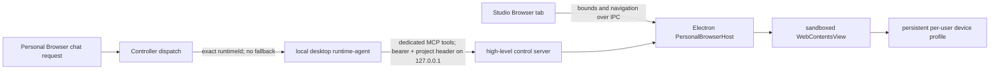

# Personal Browser

> **Status: desktop release path, enabled by default.** The Electron app uses an explicit environment value of `0`, `false`, `no`, or `off` only as an emergency kill switch. Packaged builds include a platform-matched, checksum-verified `runtime-agent`; Personal turns use a dedicated bounded MCP server and do not expose the browser capability to shell subprocesses.

Personal Browser is the desktop-only browser identity for one Instafy user on one device. It renders a native Chromium surface inside the Electron app, keeps that user's browser state locally, and gives an explicitly resumed local agent a narrow, confirmed control channel. It complements rather than replaces the remote Shared Browser.

For the user-facing profile choices, cross-project/device login continuity, and
the exact scope of Clear Data, see [Browser profiles](Browser-Profiles.md).

Personal Browser is permanently non-shareable. Project membership, Shared Browser presence, workspace leases, runtime preference, reconnect logic, and provider fallback never grant another user discovery, pixels, input, or job authority over this device-local runtime. The controller attests its immutable owner, Electron binds it to the current signed-in profile, and a Personal task fails closed if that exact runtime disappears. A future Team runtime would be a separate enrollment and consent product; Personal Browser will not be upgraded into one. See [Self-Hosted-Runtime-Security.md](./Self-Hosted-Runtime-Security.md).

## Product model

| Surface | Renderer and location | Browser identity | Intended availability |
| --- | --- | --- | --- |
| **Personal on this device** | Electron `WebContentsView` using Electron's bundled Chromium, on the user's computer | Persistent local profile derived from the signed-in Instafy user | Desktop app |
| **Shared with your team** | Headed Chromium in the project cloud runtime, rendered through WebRTC, CDP screencast, or HiDPI RFB | Per-project profile that may be shared by project members | Web, mobile, and desktop; remote persistence has its own default-off policy |
| **Google Chrome integration** | The user's separately installed Chrome | Existing Chrome tabs, profile, extensions, and Chrome Sync state | Not implemented; a future extension bridge would be required |

Personal Browser does **not** embed or take over the installed Google Chrome application. A `WebContentsView` is a native Chromium renderer inside Electron, but it has a separate profile. It does not inherit Chrome tabs, cookies, saved passwords, extensions, or Chrome Sync. Trying to reuse the default Chrome profile would cross a much broader security boundary and is not part of this product.

The machine's `~/.codex/auth.json` is a separate concern: it authorizes the AI
model used for an agent turn. Importing that file makes the turn BYOC; it does
not authenticate the browser, copy Chrome cookies, or alter the Personal
Browser profile. Browser sign-in still happens manually inside the visible
device-local Chromium surface, while the AI credential is handled through the
Instafy connection flow.

That Desktop connection is a main-process security boundary. Electron reads only
`~/.codex/auth.json`, sanitizes it to the ChatGPT subscription token fields,
removes `OPENAI_API_KEY` and unknown fields, and sends it directly to the pinned
controller origin configured by the signed desktop build. Main obtains and validates the top-level Studio
frame's signed-in Supabase session itself; renderer/preload callers cannot choose
a different controller origin or supply a bearer token. Preload and renderer
JavaScript can query only whether a usable default login exists and receive only
sanitized credential metadata after connection; neither the local path nor the
credential contents cross the bridge.

## Architecture

The visible browser and the agent control path are deliberately separate:



The Studio renderer selects **Personal on this device**, opens the Electron browser host, and starts a desktop runtime. The controller assigns a fresh UUID in the signed runtime token, and Personal Browser sends then carry `browserTransport: "desktop-personal"` with that exact returned runtime ID. The controller validates that the runtime is self-hosted, recent and dispatchable, carries a controller-attested Personal Browser capability, and is owned by the authenticated user who submitted the request. Ownership is immutable for that runtime ID, and an existing ordinary runtime cannot be converted into a Personal runtime. Final-target validation runs even if a caller omits the transport label; leasing is bound to the signed token runtime ID even when controller strict mode is off. Agent bindings, runtime-spread metadata, reconnect recovery, cleanup sweeps, and hosted-runtime selection cannot retarget a Personal Browser job.

If the exact desktop runtime is unavailable before enqueue, the send fails closed. Dispatch holds a database lock through enqueue so a concurrent stop cannot strand a newly queued job. If it disconnects after enqueue, including an idempotent or dev-offline stop path, the controller fails the Personal Browser job and run with an explicit disconnect error while preserving the target runtime ID. It must never drift to the Shared Browser or another runtime. The runtime-agent independently rejects Personal Browser metadata when its complete project-matched local capability is absent, and a Personal-capable runtime rejects every ordinary job before heartbeat, secrets, or execution.

Hosted runtimes reach the AI proxy over the private Docker origin
`http://proxy:8789`. A packaged Personal runtime runs on the user's computer,
so Electron instead pins `PROXY_BASE_URL` to the desktop build's trusted
controller HTTPS origin. A reverse proxy routes only the four exact authenticated POST
endpoints (`/v1/responses`, `/v1/chat/completions`, `/v1/audio/speech`, and
`/v1/audio/transcriptions`) to the otherwise-unpublished proxy container; all
other controller paths keep their normal upstream. The proxy validates the
short-lived `aud=proxy` controller token before reading the request body. The
external lane additionally requires UUID project, runtime, run, and BYOC
credential claims; a registration token or credentialless job token cannot use
the controller sidecar's managed platform key. The controller-side proxy also
requires the BYOC credential claim globally, even if a reverse-proxy marker is
missing, and hosted startup should fail closed unless controller-backed
authentication is active. Its health endpoint remains private. This reuses the
controller TLS/network boundary and does not require a public proxy port
or a new infrastructure service.

## Local identity and persistence

Electron creates a persistent session partition named from a SHA-256-derived form of a server-attested local profile key. On every open, Electron main reads the top-level Studio frame's current Supabase session, checks that the JWT subject and visible user agree, and sends that bearer directly to the pinned controller `GET /me/session` endpoint. The caller must supply the matching `controllerAccessToken`; main independently resolves the visible session and rejects a missing or mismatched token. It re-reads the visible session after the round trip and derives the partition key only from the controller's authenticated `userId`; the renderer's UI identity scope cannot select a different authenticated profile or controller authority. A missing, changed, mismatched, or unverifiable session destroys the mounted view and revokes its runtime while retaining the correct user's on-disk profile for a later authenticated reopen. Raw user identity is never used as the partition name. Each hook/open also receives a fresh opaque owner binding. Electron serializes ownership-changing operations and conditionally ignores stale owners, so a late completion from an unmounted renderer cannot close, navigate, resume, or reuse a newer binding. Studio pauses/rebinds the view and rotates the runtime capability when the account, project, or renderer owner changes.

A transient Studio renderer remount uses a separate owner-scoped **release** operation instead of destructive Close. Release synchronously revokes the broker generation, clears the runtime ID and owner, hides the view, and suspends the local runtime. The exact in-memory `WebContentsView` may then be reclaimed by the same user/project identity for up to ten seconds, preserving its URL, history, and live DOM without reloading or persisting a token-bearing URL separately. A different identity closes it immediately; an unreclaimed release expires destructively. Main-renderer navigation or failure uses the same revocation boundary, and queued mutations carry the originating main-frame generation, so neither an in-flight nor a queued request from a reloaded renderer can regain control. Page loads are bounded and cancelled on release; runtime shutdown is also bounded and escalates from `SIGINT` to `SIGTERM` and `SIGKILL` so cleanup cannot wedge future browser work.

This means:

- persistent cookies and site storage remain on that device across app/browser restarts, subject to site expiry, server revocation, and session-specific storage behavior;
- the same signed-in Instafy user gets the same Personal Browser profile on that device;
- a different Instafy user gets a different partition;
- projects do not receive the cookie database or encryption material;
- each project still needs its own live control capability and per-origin approval before its agent can read or act on a page;
- **Clear personal browser data** pauses agent control, navigates to `about:blank`, and clears storage, cache, and HTTP authentication state.

The partition is user-scoped, not project-scoped: a login can therefore follow that user between projects on the same device. It is never team-shared, and every project must still receive an explicit session origin approval before its agent can use the logged-in page.

This is normal local Electron/Chromium profile storage. Do not describe it as zero-knowledge storage or as importing Chrome's protected profile. Page text returned by a snapshot, and task-relevant content derived from it, can still be sent to the configured AI provider during an agent turn even though cookies remain local.

## User authorization and safety

Personal Browser is gated at several layers.

### Feature and control gates

- The desktop feature is enabled by default. `INSTAFY_DESKTOP_PERSONAL_BROWSER=0` (or `false`, `no`, or `off`) is an emergency installation-level kill switch.
- Opening the browser does not authorize the agent. `agentControlEnabled` starts false, and the local runtime does not start until the user resumes control.
- The user must explicitly choose **Resume** before agent work can start.
- While control is resumed, Electron places a transparent native `WebContentsView` input shield above the Personal page. Pointer, wheel, drag, context-menu, and keyboard input cannot race agent mutations, and the browser bar's human navigation controls are disabled in both Studio and Electron main. The shield shows **Agent control · Esc to pause**; Escape synchronously revokes the broker and then suspends the Personal runtime. Pause removes the shield and returns focus to the page only after already-dispatched native operations settle.
- Pause synchronously revokes the broker binding before waiting on navigation or runtime shutdown, then stops the Personal Browser runtime and invalidates in-flight work. Resume creates a fresh broker token; every restarted/started Personal runtime receives a fresh runtime ID. A request that races revocation fails with `401 stale_token`; a paused but still-current operation is rejected with `423 agent_control_paused`.
- Closing the Personal Browser, changing project/account/renderer identity, clearing its binding, or stopping the app invalidates the live capability.
- The frontend owner lease is also conversation-scoped. Changing conversations
  revokes control and clears manual-input guidance before the next owner can
  reclaim the same page/profile. This does not erase cookies or copy them into a
  conversation; it prevents a previous conversation's handoff from continuing in
  the new one.

### Origin approval

In the default Ask mode, the first agent navigation to, or interaction with, an HTTP(S) origin shows a native Electron confirmation. The positive choice is **Allow for this session**. Approval is held in memory for the current project/browser session and is cleared when the browser closes, its identity changes, or browser data is cleared.

The user can navigate manually without granting agent access. Cross-origin agent navigation and link activation require approval for the destination origin, unless routine browsing was explicitly granted as described below.

### One-shot activation confirmation

In the default **Ask** mode, every agent activation of a button, link, submit-like input, or form submission shows a native **Allow once** confirmation, independent of its label. Explicit same-origin URL navigation is also confirmed after that origin has already been approved. Password, OTP, and payment entry remains hard-blocked rather than confirmable.

At Resume, the user may explicitly choose **Always allow routine browsing**.
Electron requires a native confirmation before enabling this mode. It permits
ordinary navigation, clicks and non-sensitive field filling across sites in the
current project/browser control session without repeated site/action prompts.
Recognized consequential controls and URLs, form submissions, and Enter/Space
activation still ask; secret-entry blocks and fresh-target validation remain.
Pause, Escape, closing, clearing data, or changing the user/project/renderer
revokes this grant. The visible checkbox may retain its selection while this
browser surface stays open, but a later Resume requires a fresh native
confirmation; no permission is saved to the browser profile or shared with teammates.

Submission checks use the browser's actual form association and normalized button
type, not a button's label. Genuine submission controls still ask; ordinary
non-submitting buttons may use the routine grant. Form ownership is part of the
fresh-target check, so a changed association requires a new observation.

Routine mode uses a conservative text/descriptor classifier, not a proof that
ordinary controls are harmless. A website can attach unexpected side effects to
an ordinary click. Keep Ask mode when every activation needs human review.

The text-based high-impact classifier remains defense in depth for custom controls and activation keys, not a proof that every consequential control is detected. Keep adversarial coverage against real applications and conservative classifier updates in the release loop.

### Sensitive input is hard-blocked

Agent typing into the following classes of fields is rejected, even after origin approval:

- passwords, passcodes, PINs, and password-manager fields;
- one-time codes, OTP, 2FA/MFA, and verification/security codes;
- card numbers, CVV/CVC, expiration values, cardholder fields, and payment-like fields.

Detection checks input type, autocomplete tokens, accessible labels, names, placeholders, IDs, and related descriptors before and after focus. The user may Pause (or press Escape) and complete these steps manually in the visible browser; the agent cannot type them through the RPC.

### Renderer restrictions

The `WebContentsView` uses context isolation, sandboxing, no Node.js integration, normal web security, disabled DevTools, no `<webview>` attachment, denied popups, and no insecure mixed-content override. The Personal Browser session denies permission requests and downloads.

## Agent control protocol

The Electron main process starts an HTTP server on an ephemeral `127.0.0.1` port and binds it to one project. It creates a random 32-byte session bearer capability. Requests are accepted only when all of the following match:

- loopback `Host` header and the server's exact port;
- no browser `Origin` header;
- constant-time bearer-token comparison;
- `X-Instafy-Project-Id` equal to the active binding;
- one of the fixed high-level routes below.

Every broker binding has a monotonically increasing generation. The server revalidates that generation after reading a request body, immediately before operation dispatch, and before returning success. Pause, identity changes, data clearing, and close rotate the generation so a slow request authenticated under an older profile cannot act on the next one. Separately, Electron main owner-validates and serializes open, navigation, Pause/Resume, clear, close, and Personal runtime start operations.

Snapshot targets carry a renderer-local element identity plus a canonical security fingerprint covering role, type, labels, destination, form context, and sensitive-input metadata. Click, type, and press pass that expected pair into the same isolated renderer script that performs the mutation. The script re-resolves the snapshot index and rejects an identity or fingerprint mismatch before dispatching a click, changing a value, or emitting a key event; type and press recheck again after focus. There is no main-process “inspect now, send native input later” gap, so DOM reordering or focus handlers cannot retarget an approved action.

The desktop launcher strips ambient values for these names, then passes the active capability through explicit protected runtime options:

- `INSTAFY_PERSONAL_BROWSER_CONTROL_URL`
- `INSTAFY_PERSONAL_BROWSER_CONTROL_TOKEN`
- `INSTAFY_PERSONAL_BROWSER_PROJECT_ID`
- `INSTAFY_RUNTIME_AGENT_BIN`

Every job, including a Personal job, strips these values from the Codex shell environment. Runtime startup captures the capability in a trusted process-local store and removes it from the parent environment before worker threads start. A Personal turn uses a fresh, non-persisted Codex thread and registers one required `instafy_personal_browser` Streamable HTTP MCP server. The trusted runtime places the bearer only in that turn's ephemeral in-memory transport header, adds the project header, and exposes only the eight allowlisted tools, including manual-input handoff. Personal MCP configuration is never serialized through the thread-refresh operation. The shell tool is disabled for the turn; the token never enters command arguments, subprocess environments, rollout events, learned memory, or files, and current logging paths do not emit it.

The model sees these dedicated tools, not Node, Playwright, a shell helper, or an exposed CDP port:

```text
instafy_personal_browser.status
instafy_personal_browser.snapshot
instafy_personal_browser.navigate / click / type / press / scroll
instafy_personal_browser.request_human_input
```

| MCP tool | Purpose |
| --- | --- |
| `status` | Read readiness and whether control is resumed; URL/title stay redacted until control is enabled and the current origin is approved |
| `snapshot` | Read URL, title, bounded visible text, and indexed interactive descriptors |
| `navigate` | Navigate the visible page to an absolute credential-free HTTP(S) URL |
| `click` | Click one target by its fresh snapshot index |
| `type` | Type bounded text into a non-sensitive editable target, optionally submitting with Enter |
| `press` | Apply one allowlisted key to a fresh observed target inside the same guarded renderer turn |
| `scroll` | Scroll the visible page by bounded CSS-pixel deltas |
| `request_human_input` | Highlight one to eight fresh observed fields, revoke agent control, and ask the user to fill them directly |

### Manual steps and continuation

**Take over** pauses agent control for a manual step, even when the AI has not
requested one. The agent can also call `request_human_input` with fresh snapshot
indices. The native host applies fixed amber outlines to the actual editable
elements, so they move with scrolling and reflow; replaced elements do not inherit
old highlights. Guidance contains only generic field labels and an expiring
request identity, never field values or DOM-derived text. The broker is revoked
before input returns to the user and the current runtime is suspended. The native
`humanControlReady` status additionally requires every active host operation to
finish; revocation alone is not sufficient. Until then, manual input and Resume
remain blocked. A 15-second drain timeout reports an error but keeps the shield
locked rather than falsely claiming control has returned.

**Done, continue** is an explicit new browser turn, not resumption of a suspended
tool call. During a manual step, it is the only resume-and-send action: ordinary
toolbar Resume and Retry agent control are hidden, including after a failed
continuation. Retrying Done waits for the fresh runtime's readiness rather than
reusing the previous attempt's error; startup remains bounded to 30 seconds and
never dispatches through a stale runtime. Pause remains available whenever agent
control is enabled. If startup fails before a fresh runtime can be identified,
use Pause to return manual control before retrying Done.
Done clears highlights and creates fresh control authority; the new
turn observes the page again instead of replaying old indices. Changing the
account/project/page binding or an expired request cannot silently continue work.
Passwords, codes and payment values stay in the page and must not be entered in
chat. The continuation message contains none of those values, but a later page
observation can include visible website content; manual entry is not a promise
that the website will never expose it. Ordinary site behavior and the existing
profile policy still apply.

The MCP endpoint rejects unauthenticated callers, arbitrary tools, unknown argument fields, oversized request bodies, and stale capability generations. The host applies the same target, URL, key, sensitive-input, origin-approval, and one-shot activation confirmation checks to MCP calls as it does to visible browser operations. The legacy Rust request client remains available for low-level diagnostics, but it is not exposed to the model or its shell.

The Rust client also disables proxy discovery for this loopback request so `HTTP_PROXY`, `HTTPS_PROXY`, or system proxy configuration cannot receive the bearer or project header.

This is intentionally higher-level than CDP. The agent receives structured page evidence and bounded actions, not a general debugging socket into Electron.

## Shared Browser fallback

Shared Browser remains a separate user-selected transport. It runs inside an isolated project cloud container and is streamed into the same Browser subtab. New runtimes use an Instafy-owned address/Go/history toolbar over viewport-only Chromium. CDP screencast supports normal and compact widths, with HiDPI RFB/noVNC as the final safety fallback; an allowlisted WebRTC runtime may become the normal-width preference while compact Studio deliberately remains on CDP for true responsive reflow. Every lane stays on the same runtime and project/team profile. Durable project/team profile persistence is separately gated and default-off. See `docs/Shared-Browser.md`.

Remote profile persistence is independently default-off behind the controller-owned `BROWSER_PROFILE_PERSIST_PROJECT_IDS` allowlist. The controller strips protected persistence settings from client/provider runtime metadata, injects them only for exact allowlisted project UUIDs, and enforces the same policy at token issuance and the profile API.

The UI may recommend or let the user select Shared Browser when Personal Browser is unsupported or disabled. Once a Personal Browser task is submitted, however, execution is pinned and must not silently fall back to Shared Browser.

An explicit Personal/Shared choice is remembered per signed-in user on that device. Both transports use the same single-row Browser toolbar with an in-field **Go** action, and the primary **Chat / Browser** tabs are the only return control; there is no duplicate Back-to-chat button or transient privacy toast covering narrow controls. Returning to Chat hides the surface without closing the Personal page or disconnecting the mounted Shared viewer. The empty Browser-mode composer condenses to one row and expands around the same mounted editor as soon as a draft or richer state appears. Browser feedback uses a full-width row instead of truncating errors inside the address bar. Switching transports exits Shared fullscreen but preserves its background connection, capability document, and page state. Shared page targeting, including **New shared site**, is deliberately unavailable while Personal Browser is selected so a Personal request cannot inherit a stale remote page target; only those targeting controls are disabled, not the Shared session itself.

## Product limits

- One visible page only. Multi-site work must navigate the same page sequentially; there are no tab/window RPCs.
- No Chrome extensions, Chrome Sync, existing Chrome tabs, or imported Chrome profile/password state.
- No downloads, permission-granting flows, popups, or new windows.
- No screenshot RPC. Snapshot returns structured text and interactive descriptors, not image bytes.
- No general CDP, Playwright, arbitrary JavaScript, filesystem, or Electron debugging access.
- Desktop Electron only; web and mobile continue to use Shared Browser.
- One desktop runtime is supervised by the app at a time.
- High-impact detection is heuristic and needs further adversarial coverage.
- The desktop shell tracks the currently supported Electron line and must be upgraded as Electron support windows move.
- The packaging workflow builds the Rust runtime on each target OS, stages it as an Electron extra resource, finalizes its platform/architecture/size/SHA-256/source-commit manifest over the post-sign bytes, and self-invokes `runtime-agent --version`. Packaged launches ignore renderer, config, and environment binary overrides.
- Release artifacts should pass platform signing, updater-checksum verification, and final
  installer/archive extraction. Do not publish Linux AppImage metadata until an equivalent signing
  and final-installer verification path exists; a source-tree Electron smoke is not an installer
  smoke.

## Local test procedure

Build the local runtime executable first:

```bash
cargo build --manifest-path packages/runtime-agent/Cargo.toml --bin runtime-agent
```

With the local controller/proxy prerequisites running, launch the developer desktop app. A development build can still select an explicit local runtime executable:

```bash
INSTAFY_RUNTIME_AGENT_BIN="$PWD/packages/runtime-agent/target/debug/runtime-agent" \
pnpm dev:desktop
```

Manual smoke sequence:

1. Sign in to Instafy and open a project in the Electron app.
2. Open the Browser subtab and select **Personal on this device**.
3. Navigate manually to a test site and, if needed, sign in manually.
4. Choose **Resume**; confirm the site origin when the agent first requests it.
5. Send a browser task and verify the controller targets the exact Personal Browser runtime ID.
6. Switch Chat ↔ Browser and confirm the native view remains usable; briefly remount/reopen the same Studio conversation and confirm the released native page is reclaimed paused rather than reset.
7. Verify Pause produces no agent action and no hosted fallback.
8. Exercise a harmless link, button, and form submission and verify **Allow once** appears for each activation.
9. Verify password, OTP, and payment-field typing is rejected while manual typing still works.
10. Restart the app and verify the local login persists; then use **Clear personal browser data** and verify it is removed.

Relevant automated checks:

```bash
pnpm --filter @instafy/desktop-runtime-agent exec vitest run
pnpm --filter @instafy/desktop-runtime-agent lint
pnpm --filter @instafy/desktop-runtime-agent build

cargo test --manifest-path packages/runtime-agent/Cargo.toml --lib
cargo check --manifest-path packages/runtime-agent/Cargo.toml --bin runtime-agent

cargo test --manifest-path packages/runtime-controller/Cargo.toml \
  personal_browser_jobs_require_and_preserve_the_explicit_desktop_runtime
cargo test --manifest-path packages/runtime-controller/Cargo.toml \
  personal_browser_metadata_accepts_snake_case_alias

pnpm --filter @instafy/desktop-app test
pnpm --filter @instafy/desktop-app lint

pnpm --filter @instafy/frontend exec vitest run \
  src/screens/studio/components/__tests__/PersonalBrowserSurface.test.tsx \
  src/screens/studio/components/__tests__/personalBrowserBridge.test.ts \
  src/screens/studio/components/__tests__/personalBrowserSubmitRouting.test.ts \
  src/screens/studio/components/__tests__/useChatSubmitDispatch.test.tsx

pnpm --filter @instafy/frontend test:e2e:desktop:personal-browser

pnpm quality:frontend:required
```

Before publishing a desktop package, run a real packaged Electron smoke. Browser-only Playwright
cannot validate `WebContentsView` composition or the bundled runtime binary. The verifier should
reject archive traversal, escaping symlinks, special files, extra app bundles, and any bundled
`auth.json`, then validate platform signing and launch the extracted executable.

If the smoke exercises BYOC, import `~/.codex/auth.json` only through the visible sealed Desktop
connection flow. Never copy it into the application, repository, environment, or uploaded
artifacts. Use disposable local state and verify that the turn is pinned to the exact Personal
runtime, uses BYOC without a managed-credit debit, respects sensitive-input blocks, and fails
closed after Pause.

## Release verification

Packaged release verification should prove all of the following:

1. The platform-specific bundled binary passes manifest verification,
   `--version` self-invocation, and a secret-free
   `personal-browser capabilities` self-query from the packaged resources
   directory. That compiled contract must expose exactly one required
   `instafy_personal_browser` MCP server, only the eight browser tools, no
   project MCP servers, and zero local execution environments.
2. A real packaged Personal Browser turn completes through
   `instafy_personal_browser` MCP tools without a command-execution event, while
   a poisoned runtime override proves the bundled runtime was selected.
3. The desktop runtime registers the controller-assigned owned runtime ID, uses
   a run-scoped BYOC proxy token, and disappears after Pause without Shared or
   managed-AI fallback.
4. The disposable page's safe field changes while password, OTP, card, and
   activation state remain unchanged; the proof observes exactly one origin
   approval and no failed Personal Browser MCP call.
5. Each platform package satisfies its signing, extraction, and updater-checksum gates before the
   exact extracted executable is launched.
6. Test cleanup removes the disposable local profile, runtime, and credential.

The wider defense-in-depth suite remains required engineering work. It covers
Escape emergency pause, pointer/keyboard locking, origin and activation denial,
capability rotation, runtime death, sign-out, data clearing, updater behavior,
token/log redaction, DOM reorder and focus-time retargeting, representative
authenticated sites, and equivalent live Windows behavior. Unit, component,
controller, runtime, and source-tree Electron tests cover many of those cases.
Deployment-specific canary accounts, runners, publication gates, and recovery procedures are
maintained separately.
